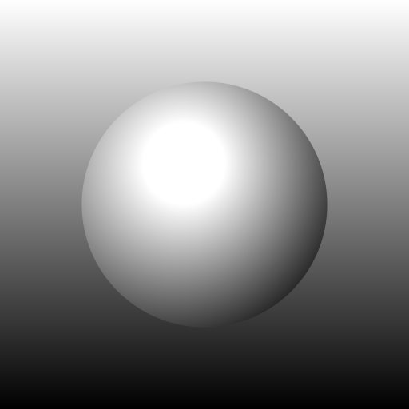

# Samples

The file `samples.cc` shows the [cairo samples](https://www.cairographics.org/samples/) adapted to **cairopp**. As the original samples, the file is in the public domain. Some samples use a [public domain image](https://www.publicdomainpictures.net/en/view-image.php?image=211882&picture=landscape-with-a-lake) that is included in the `images` subdirectory.

## Outputs

### arc

### arc_negative

### clip

### clip_image

### curve_rectangle

### curve_to

### dash

### fill_and_stroke

### fill_style

### gradient

### image

### image_pattern

### multi_segments_cap

### rounded_rectangle

### set_line_cap

### set_line_join

### text

### text_align_center

### text_extents

